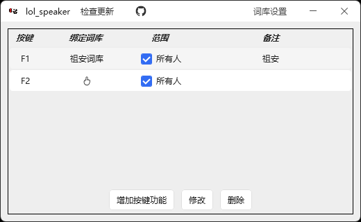
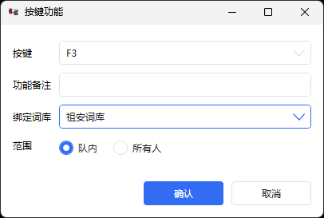
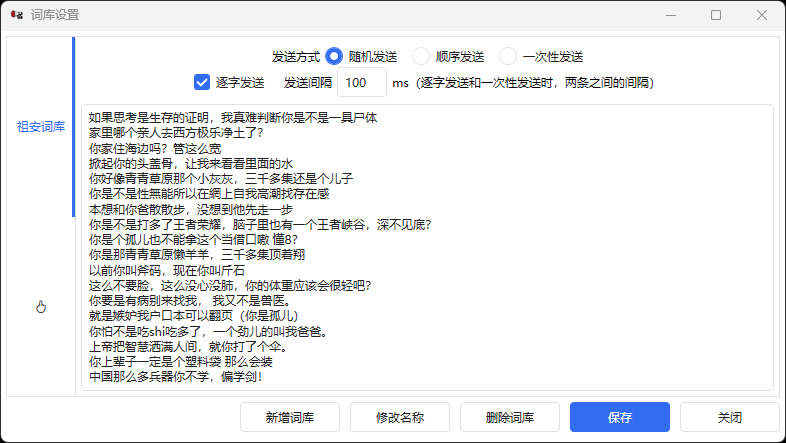

# lol_speaker



英雄联盟发言小工具：把常用话术存成词库，一键快捷发送，作为南极恶畜家太子软件的平替。

> 本项目的起点是 [ZuAnBot（祖安助手）](https://github.com/liuke-wuhan/ZuAnBot)，在其基础上重做了界面和词库的编辑方式。

## 使用

从 [Releases](https://github.com/OFPC2Y/lol_speaker/releases/latest) 下载 `lol_speaker.exe`，免安装，双击即可。

程序会请求管理员权限——因为要往游戏里注入按键。

## 功能

### 按键功能



每个按键功能包含四个配置项：

| 项目 | 说明 |
| --- | --- |
| 按键 | F1 ~ F12 里挑一个 |
| 绑定词库 | 按下这个键发哪个词库的内容 |
| 备注 | 这个按键是干嘛的，随便写 |
| 范围 | **队内** / **所有人**。选「所有人」时，发送内容会自动带上 `/all ` 前缀 |

### 词库



每个词库都有一个文本框，文本框内一行一条词条

每个词库的发送方式三选一：

* **随机发送**     —— 每次随机抽一条
* **顺序发送**     —— 按顺序从头到尾的发，发到末尾回到第一条；发到哪儿了会记住，重启程序可以续杯
* **一次性发送** —— 按一次键，把整个词库逐条发出去，用于一键发送艺术品，也正是本次重构的目的

另外有两项可配置项：

* **发送间隔** —— 逐字发送和一次性发送时，两条消息之间的间隔，单位毫秒，默认 100
* **逐字发送** —— 一个字发一条消息，用于绕过游戏内屏蔽

## 注意

* 注意节制。这个工具的初心是对付喷子，别自己成了喷子。
* 不要高频使用。发太多被举报，是有禁言甚至封号风险的。

## 构建

需要 .NET SDK（本项目用 8.0 验证过）。在仓库根目录执行：

```bash
dotnet build LolSpeaker/LolSpeaker.csproj -c Release
```

产物是 `LolSpeaker/bin/Release/net472/lol_speaker.exe`，**单文件**——依赖的 dll 和更新程序都被 Costura 打进这一个 exe 里了，拷到哪都能直接跑。

（同目录还会生成一个 `lol_speaker.exe.config`，是自动生成的绑定重定向文件。单独拷 exe 跑用不到它，可以不管。）

## 本地配置

词库和配置都在用户目录下，想备份或者换机器，直接拷这个文件夹：

```
%LOCALAPPDATA%\lol_speaker\
├── wordsLibrary.json   词库、按键功能、发送设置
└── sendState.json      顺序发送发到哪了
```

## 致谢

* [ZuAnBot](https://github.com/liuke-wuhan/ZuAnBot) —— 本项目的起点
* [祖安宝典](https://github.com/cndiandian/zuanbot.com) —— ZuAnBot 的灵感来源
